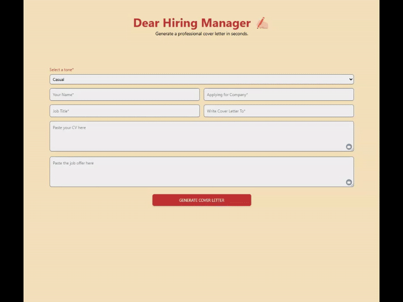

# 📝 Job Application Generator

A simple React-based web app that helps users generate tailored job application letters using the OpenAI API. The form collects relevant user details, dynamically builds a request, and displays a generated letter that can be copied and used in job applications.

## 🌟 Features

- Dynamic form handling based on user inputs  
- Integration with OpenAI's ChatGPT API  
- Generates job-specific cover letters instantly  
- Clean and responsive UI built with React  
- Option to copy and reuse the generated letter

## 🛠️ Tech Stack

- React  
- Node.js  
- OpenAI API (ChatGPT)

## Backend

This project includes a simple Node.js backend (not published here) that serves as a lightweight proxy to the OpenAI Chat API. The backend:

- Accepts POST requests with form and user input
- Constructs a prompt based on the input
- Sends the request to the ChatGPT API
- Returns the generated application letter to the frontend

The backend is kept private to avoid exposing API keys. If needed, I can share a stripped-down version or explain the logic in more detail.

